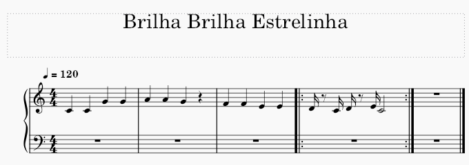
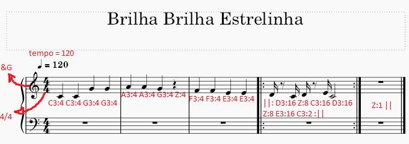

# Linguagem de partituras musicais 

# Feito Por:
- Guilherme Rameh


## ToDo's Do Projeto:

1. [x] Estruturar a linguagem segundo o padrão EBNF.
2. [x] Utilizar as ferramentas Flex e Bison (ou semelhantes) para realizar as etapas de Análise Léxica e Sintática.
3. [x] Utilizar a LLVM (ou semelhantes - incluindo o próprio compilador) para implementar a sua linguagem até a fase final de compilação. Não é preciso implementar um compilador novo.
4. [x] Criar um exemplo de testes que demonstre as características da sua Linguagem.
5. [x] Montar uma apresentação com slides apresentando sua linguagem (Motivação, Características, Curiosidades e Exemplos). Colocar no Git.

## EBNF:

``` lua
MUSICA = TITULO, ANDAMENTO, ESCALA, DIVISAO_METRICA, {COMPASSO}+, FIM_DA_MUSICA;

TITULO = (LETTER | DIGIT), {LETTER | " " | DIGIT}*;

ANDAMENTO = "tempo = ", {DIGIT}+;

DIVISAO_METRICA = DIGIT, "/", DIGIT;

COMPASSO = CLAVE?, {NOTA | PAUSA}+, ";";

PAUSA = "Z:", DURACAO;

LOOP = "||:", {COMPASSO}+, ":||", ;

FIM_DA_MUSICA = "||";

CLAVE = ("&G" | "&F");

NOTA = FORA_DE_ESCALA?, {ALTURA, DIGIT, ":", DURACAO};

FORA_DE_ESCALA = ("#" | "b");

CONDITIONAL = ("jônio" | "dórico" | "frígio" | "lídio" | "mixolídio" | "eólio" | "lócrio");

ESCALA = ALTURA, CONDITIONAL;

DURACAO = "1" | "2" | "4" | "8" | "16" | "32" | "64";

ALTURA = "A" | "B" | "C" | "D" | "E" | "F" | "G";

LETTER = ("A" | "B" | "C" | "D" | "E" | "F" | "G" | "H" | "I" | "J" | "K" | "L" | "M" | "N" | "O" | "P" | "Q" | "R" | "S" | "T" | "U" | "V" | "W" | "X" | "Y" | "Z" | "a" | "b" | "c" | "d" | "e" | "f" | "g" | "h" | "i" | "j" | "k" | "l" | "m" | "n" | "o" | "p"| "q" | "r" | "s" | "t" | "u" | "v" | "w" | "x" | "y" | "z") ;

DIGIT = ("0" | "1" | "2" | "3" | "4" | "5" | "6" | "7" | "8" | "9") ;
```

## Exemplo de código:
``` lua
Brilha Brilha Estrelinha

tempo = 120

C jônico

4/4

&G C3:4 C3:4 G3:4 G3:4 ; A3:4 A3:4 G3:4 Z:4; F3:4 F3:4 E3:4 E3:4;
||: D3:16 Z:8 C3:16 D3:16 Z:8 E3:16 C3:2 :||; Z:1 ||
```

## Comparando com a partitura:

### ORIGINAL:



### EXPLICADA:




## Instruções:

Para rodar o programa de exemplo (Brilha Brilha Estrelinha), basta rodar o arquivo `main.py`, sem modificações.
Para modificar o exemplo, é necessário mudar, dentro do mesmo arquivo, a string denominada `text_input`, na função `main`.

## Apresentação:

Os slides para a apresentação foram colocados aqui no Github também, e estão denominados como "PP_Linguagem_Gui".
